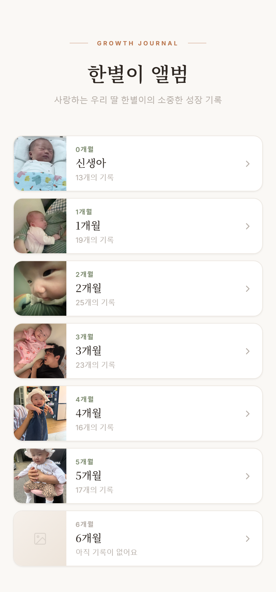
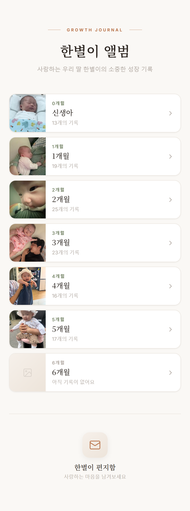

<div align="center">

# 🌟 한별이 앨범 · inonestar

**사랑하는 우리 딸 한별이의 소중한 성장 기록**

월(月)별로 아기의 사진과 영상을 차곡차곡 모아두고,
가족과 지인이 따뜻한 편지를 남길 수 있는 개인 성장 앨범 웹 서비스입니다.

<br/>

[](https://inonestar.obliviscor29.workers.dev)

<br/>


<br/>



</div>

<br/>

## ✨ 주요 기능

- 📅 **월별 성장 앨범** — 신생아부터 개월 수별 폴더로 사진·영상을 정리하고, 폴더마다 대표 커버와 기록 개수를 한눈에
- 🖼️ **사진 & 영상 타임라인** — 날짜순으로 정렬된 순간들을 상세 뷰어(라이트박스)로 크게 감상, 영상은 인앱 재생
- 💌 **편지함** — 가족·지인이 이름과 메시지를 남기는 방명록, 남겨진 편지를 함께 모아보기
- 🔒 **관리자 페이지** (`/pej`) — 비밀번호 인증 후 사진·영상 업로드, 제목·날짜 편집, 대표 이미지 설정, 사진·편지 삭제
- 📱 **모바일 최적화** — 세로 화면에 맞춘 반응형 UI와 부드러운 등장 애니메이션
- 🔗 **카카오톡 공유** — Open Graph 태그로 링크 공유 시 대표 사진과 소개가 미리보기로 표시

<br/>

## 📸 미리보기

<div align="center">

| 메인 앨범 | 편지함까지 전체 화면 |
|:---:|:---:|
|  |  |

> 🌐 **직접 둘러보기 →** [inonestar.obliviscor29.workers.dev](https://inonestar.obliviscor29.workers.dev)

</div>

<br/>

## 🛠️ 기술 스택

| 구분 | 사용 기술 |
|---|---|
| **Frontend** | React 19, Vite 8 |
| **Backend** | Cloudflare Workers (`_worker.js`) |
| **Storage** | Cloudflare R2 — 사진·영상 원본 저장 · Cloudflare KV — 메타데이터/편지 |
| **Deploy** | Cloudflare (Wrangler) |
| **Design** | Noto Serif KR + Inter · 따뜻한 베이지·테라코타·세이지 팔레트 |

<br/>

## 🧱 아키텍처

```
[ React SPA ]  ──fetch──▶  [ Cloudflare Worker (_worker.js) ]
                                   │
                 ┌─────────────────┼──────────────────┐
                 ▼                                     ▼
        [ Workers KV ]                          [ R2 Bucket ]
     사진 메타데이터 · 편지 · 대표 이미지        사진 / 영상 원본 파일
```

**주요 API**

| 엔드포인트 | 설명 |
|---|---|
| `GET /api/list-photos` | 폴더별 사진·영상 목록 조회 |
| `POST /api/upload` | 사진·영상 업로드 (R2 저장 + KV 기록) |
| `POST /api/delete` | 사진 삭제 (R2 + KV) |
| `GET /api/covers` | 폴더별 대표 이미지 조회 |
| `GET /api/letters` | 편지 목록 조회 |
| `POST /api/letters` · `/api/letters/delete` | 편지 등록 / 삭제 |

<br/>

## 📁 프로젝트 구조

```
inonestar/
├─ src/
│  ├─ App.jsx         # 라우팅 (기본: 앨범, /pej: 관리자)
│  ├─ MainAlbum.jsx   # 앨범 메인 · 사진/영상 뷰어 · 편지함
│  ├─ Admin.jsx       # 관리자 · 업로드/편집/삭제
│  └─ main.jsx
├─ _worker.js         # Cloudflare Worker (API + R2/KV)
├─ wrangler.toml      # Workers · KV · R2 바인딩
└─ index.html         # OG 메타태그 (카카오톡 공유)
```

<br/>

## 🚀 로컬 실행

```bash
npm install
npm run dev        # Vite 개발 서버
npm run build      # 프로덕션 빌드 (dist/)
```

> Cloudflare Workers·KV·R2 연동은 `wrangler.toml` 설정과 바인딩이 필요합니다.

<br/>

---

<div align="center">

🤖 *AI(Claude) 바이브코딩으로 제작한 개인 프로젝트입니다.*

</div>
